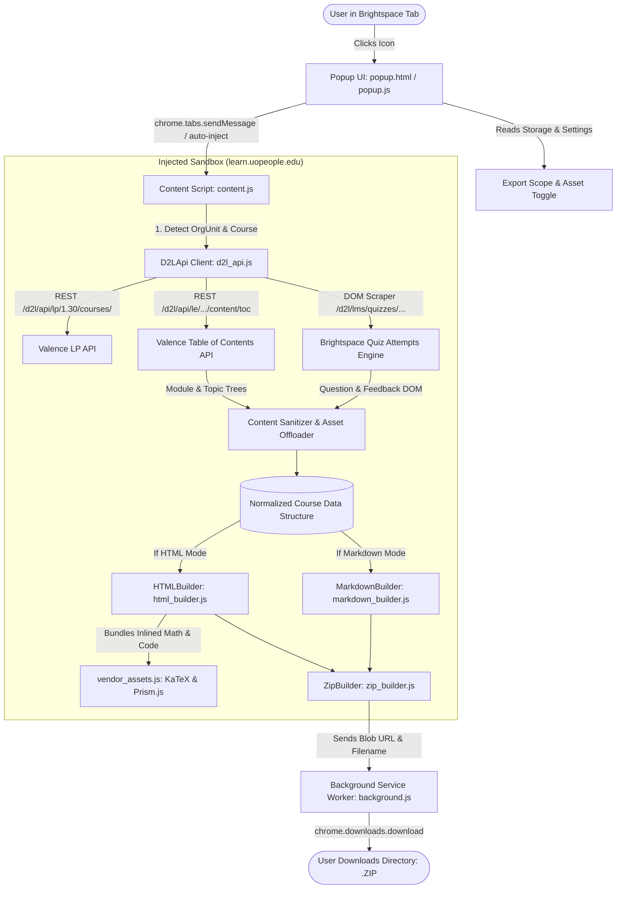

# 🏗️ Technical Architecture & Data Flow

This document details the internal architecture, module communication, API endpoints, DOM parsing logic, client-side application ergonomics, and export pipelines of the **Offline Course Exporter for UoPeople**.

---

## 🔁 High-Level Architecture Diagram



---

## 🧩 Core Modules Breakdown

### 1. `popup.html` / `popup.js` / `popup.css`
- **Role:** The control surface and configuration UI rendered in the browser toolbar.
- **Key Responsibilities:**
  - Detects active tab eligibility (`https://learn.uopeople.edu/*`).
  - **Dynamic Auto-Injection Fallback:** If the tab was opened prior to extension install/reload, `popup.js` automatically injects `vendor_assets.js`, `d2l_api.js`, `html_builder.js`, `markdown_builder.js`, `zip_builder.js`, and `content.js` without requiring manual page refresh.
  - Persists user preferences (`exportScope`: `'full'` vs `'shareable'`, `downloadAssets`: `true` vs `false`) using `chrome.storage.local`.
  - Receives live granular progress updates (`EXPORT_PROGRESS`) and updates the progress bar and status badge smoothly.
  - **Course Title Sanitization:** Runs `cleanCourseName()` to strip Brightspace page noise (`Homepage - `, `Unit X - `, etc.).

### 2. `content.js`
- **Role:** Pipeline coordinator executing within the active UoPeople page DOM.
- **Key Responsibilities:**
  - Listens for `START_EXPORT` action messages from `popup.js`.
  - Coordinates data fetching (`D2LApi.parseModules`), asset downloading, and ZIP generation.
  - Relays percentage progress messages (`EXPORT_PROGRESS`) with descriptive phase labels back to the popup.
  - Sends final ZIP package payloads to `background.js` via `DOWNLOAD_ZIP`.

### 3. `d2l_api.js`
- **Role:** D2L Valence REST API interface and DOM fallback scraper.
- **Valence REST Endpoints Queried:**
  - **Course Information:** `/d2l/api/lp/1.30/courses/{orgUnitId}` (Retrieves course name and catalog code).
  - **Table of Contents (TOC):** `/d2l/api/le/{version}/{orgUnitId}/content/toc` (Iterates versions `1.54`, `1.43`, `1.30`, `1.0`).
- **DOM Fallback & Quiz Scrapers:**
  - **Quiz List Discovery:** `/d2l/lms/quizzes/user/quizzes_list.d2l?ou={orgUnitId}` (Scrapes quiz IDs and names).
  - **Quiz Attempt Feedback:** `/d2l/lms/quizzes/user/quiz_submissions_attempt.d2l?isprv=0&qi={quizId}&ai={attemptId}&ou={orgUnitId}` (Extracts completed questions, answer options, selected answers, correctness indicators, and instructor feedback).
- **Sanitization & Transformation Engine:**
  - `cleanContentHtml()`: Strips LockDown browser scaffolding, tracking pixels, empty hidden forms, D2L courseware hero banners (`courseware-headers-*`), and redundant logo footers (`LogoMinimal_Purple.png`).
  - `cleanUnitDescription()`: Strips duplicate internal `<h2>` titles, `<hr>` dividers, and stray `&nbsp;` / comment delimiters.
  - `shouldKeepAttachment()`: Filters out duplicate syllabus and course overview PDFs from subsequent weekly unit folders.
  - `processYouTubeEmbeds()`: Converts broken YouTube iframes (`Error 153`) into clean thumbnail cards with direct watch links.
  - **Early Crawler Filtering:** When `exportScope === 'shareable'`, skips fetching discussions, assignments, and quizzes at the network stage.

### 4. `html_builder.js`
- **Role:** Builds a standalone, interactive, single-page offline web application (`index.html`).
- **Interactive UI & Ergonomics:**
  - **Collapsible Unit Navigation:** Clicking an active unit collapses/contracts its section list. Empty states gracefully prompt section selection.
  - **Sticky Section Index Bar:** Sticky top navigation pills with auto-scrollspy tracking as the user scrolls.
  - **Full-Text Live Search Engine:** Client-side search indexing unit titles, topics, and question banks.
  - **100% Offline KaTeX Math:** Automatically parses and renders `$...$` and `$$...$$` math notation without network calls.
  - **Prism.js Syntax Highlighting:** Monospace styling, syntax highlighting, and 1-click **📋 Copy Code** buttons.
  - **Interactive Collapsible Quizzes:** Expandable question accordions with dynamic show/hide toggle badges.
  - **Document Preview Modal:** In-portal modal viewer allowing students to inspect PDF and HTML readings directly inside the offline app.
  - **Study Progress Persistence:** Checkboxes for unit completion with persistent tracking in `localStorage`.
  - **Reading Time Estimator:** Real-time word-count-based reading duration calculated per unit (~200 wpm).
  - **APA Citation Copier:** Instant 1-click copy of formal APA 7th edition course citations.
  - **Linear Flow Navigation Cards:** Bottom Previous / Next unit transition cards.
  - **Keyboard Shortcuts:**
    | Key | Action |
    | :---: | :--- |
    | `[` | Navigate to Previous Unit |
    | `]` | Navigate to Next Unit |
    | `/` | Focus Live Search Bar |
    | `f` | Toggle Focus / Zen Mode (Collapses Sidebar) |
    | `t` | Toggle Dark / Light Theme |
    | `?` | Show Keyboard Shortcuts Modal |

### 5. `markdown_builder.js`
- **Role:** Generates an organized hierarchy of GitHub-Flavored Markdown files and subdirectories.
- **Output Hierarchy:**
  ```text
  ├── README.md                          # Course overview, syllabus, master reading matrix
  ├── Master_Course_Complete.md          # Unified single-file course compendium
  ├── 01_Course_Introduction/
  │   ├── 01_Overview.md
  │   └── assets/
  ├── 02_Unit_1_[Title]/
  │   ├── 01_Overview.md
  │   ├── 02_Readings.md
  │   ├── 03_Discussions.md              # Omitted in Peer-Safe Mode
  │   ├── 04_Assignments.md              # Omitted in Peer-Safe Mode
  │   ├── 05_Knowledge_Checks.md         # Omitted in Peer-Safe Mode
  │   ├── 06_Self_Quizzes.md             # Omitted in Peer-Safe Mode
  │   ├── 07_Assessment.md               # Omitted in Peer-Safe Mode
  │   ├── 08_Conclusion.md
  │   └── assets/
  └── ...
  ```
- **Master Course Complete File (`Master_Course_Complete.md`):** Consolidates all units, readings, and practice questions into a single document formatted for AI context ingestion (NotebookLM, LLM study assistants) or unified note review.
- **Master Reading Matrix (`README.md`):** Generates a comprehensive cross-unit matrix table indexing all assigned readings, textbook chapters, and library links.

### 6. `vendor_assets.js`
- **Role:** Inlines minified, offline-ready KaTeX CSS/JS and Prism.js syntax definitions directly into the extension payload, eliminating any reliance on external CDNs (`cdnjs`, `jsdelivr`, `googleapis`).

### 7. `zip_builder.js`
- **Role:** Lightweight, pure-JavaScript ZIP builder with zero external runtime dependencies.
- **Key Specifications:**
  - Formats standard PKZIP Local and Central Directory headers.
  - Sets General Purpose Bit 11 (`0x0800`) to enforce UTF-8 string encoding for filenames across Windows, macOS, and Linux.

### 8. `background.js`
- **Role:** Manifest V3 background service worker handling file system downloads via `chrome.downloads.download`.
