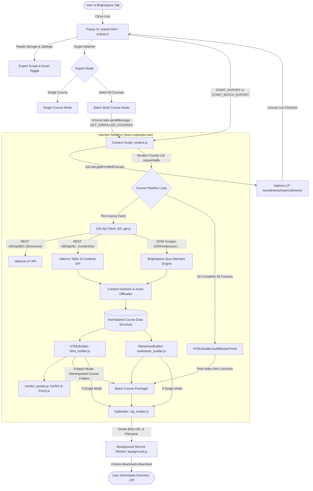

# 🏗️ Technical Architecture & Data Flow

This document details the internal architecture, module communication, API endpoints, DOM parsing logic, client-side application ergonomics, and export pipelines of the **Offline Course Exporter for UoPeople**.

---

## 🔁 High-Level Architecture Diagram


```mermaid
flowchart TD
    User([User in Brightspace Tab]) -->|Clicks Icon| Popup[Popup UI: popup.html / popup.js]
    Popup -->|Reads Storage & Settings| PopupState[Export Scope & Asset Toggle]
    Popup -->|Target Switcher| ModeSelect{Export Mode}

    ModeSelect -->|Single Course| SingleFlow[Single Course Mode]
    ModeSelect -->|Batch All Courses| BatchFlow[Batch Multi-Course Mode]

    BatchFlow -->|chrome.tabs.sendMessage: GET_ENROLLED_COURSES| ContentScript[Content Script: content.js]
    ContentScript -->|D2LApi.getEnrolledCourses| ValenceEnroll[Valence LP: /enrollments/myenrollments/]
    ValenceEnroll -->|Course List Checklist| Popup

    Popup -->|START_EXPORT or START_BATCH_EXPORT| ContentScript

    subgraph "Injected Sandbox (learn.uopeople.edu)"
        ContentScript -->|Iterates Course List sequentially| CourseLoop{Course Pipeline Loop}
        CourseLoop -->|Per-Course Fetch| D2L[D2LApi Client: d2l_api.js]
        D2L -->|REST /d2l/api/lp/1.30/courses/| ValenceLP[Valence LP API]
        D2L -->|REST /d2l/api/le/.../content/toc| ValenceTOC[Valence Table of Contents API]
        D2L -->|DOM Scraper /d2l/lms/quizzes/...| QuizAttempts[Brightspace Quiz Attempts Engine]
        
        ValenceTOC --> ContentSanitizer[Content Sanitizer & Asset Offloader]
        QuizAttempts --> ContentSanitizer
        
        ContentSanitizer --> CourseData[(Normalized Course Data Structure)]
        
        CourseData --> HTMLGen[HTMLBuilder: html_builder.js]
        CourseData --> MDGen[MarkdownBuilder: markdown_builder.js]
        
        HTMLGen --> VendorAssets[vendor_assets.js: KaTeX & Prism.js]
        
        HTMLGen -->|If Batch Mode: Namespaced Course Folders| BatchPacker[Batch Course Packager]
        MDGen --> BatchPacker
        
        CourseLoop -->|On Complete All Courses| MasterGen[HTMLBuilder.buildMasterPortal]
        MasterGen -->|Root index.html Launcher| BatchPacker
        
        BatchPacker --> ZipPacker[ZipBuilder: zip_builder.js]
        HTMLGen -->|If Single Mode| ZipPacker
        MDGen -->|If Single Mode| ZipPacker
    end
    
    ZipPacker -->|Sends Blob URL & Filename| BackgroundWorker[Background Service Worker: background.js]
    BackgroundWorker -->|chrome.downloads.download| FileSystem([User Downloads Directory: .ZIP])
```

---

## 🧩 Core Modules Breakdown

### 1. `popup.html` / `popup.js` / `popup.css`
- **Role:** The control surface and configuration UI rendered in the browser toolbar.
- **Key Responsibilities:**
  - Detects active tab eligibility (`https://learn.uopeople.edu/*`).
  - **Dynamic Auto-Injection Fallback:** If the tab was opened prior to extension install/reload, `popup.js` automatically injects `vendor_assets.js`, `d2l_api.js`, `html_builder.js`, `markdown_builder.js`, `zip_builder.js`, and `content.js` without requiring manual page refresh.
  - **Target Scope Switcher:** Segmented control (`#target-switcher`) toggling between single-course export (`#btn-target-single`) and multi-course batch export (`#btn-target-batch`). Automatically defaults to batch mode with course selection when launched from Brightspace homepage.
  - **Enrolled Course Selection & Discovery:** Automatically triggers `GET_ENROLLED_COURSES` upon switching to batch mode, populating `#batch-courses-list` with checkboxes, course codes, title tooltips, and interactive **Select All / Deselect All** controls.
  - **Dynamic CTA Adaptation:** Automatically adjusts export button text and badge count based on active selection (`Export Selected Courses (N)` vs `Export Course`).
  - Persists user preferences (`exportScope`: `'full'` vs `'shareable'`, `downloadAssets`: `true` vs `false`) using `chrome.storage.local`.
  - **Granular Progress Monitoring:** Receives live single-course (`EXPORT_PROGRESS`) and multi-course (`BATCH_EXPORT_PROGRESS`) progress events, updating progress bars, completion percentages, course index counters (`Course X of Y`), and phase status badges.
  - **Concurrency & Interaction Guards:** Disables target pills, format radios, and export triggers while export operations are active (`isExporting`).
  - **Course Title Sanitization:** Runs `cleanCourseName()` to strip Brightspace page noise (`Homepage - `, `Unit X - `, etc.).

### 2. `content.js`
- **Role:** Pipeline coordinator executing within the active UoPeople page DOM.
- **Key Responsibilities:**
  - Listens for `START_EXPORT`, `START_BATCH_EXPORT`, and `GET_ENROLLED_COURSES` action messages from `popup.js`.
  - **Export Mutex Lock (`isExportActive`):** Enforces single-operation concurrency, immediately rejecting overlapping single or batch export requests.
  - **Multi-Course Batch Pipeline (`runBatchExportPipeline`):** Sequentially processes selected courses with per-course `try/catch` error isolation, ensuring network timeouts or permissions anomalies in one course do not abort remaining courses.
  - **Namespaced Course Packaging:** Generates sanitized course directory names via `sanitizeCourseFolderName()` and prepends folder paths to individual course SPAs, markdown trees, and media assets.
  - **Master Course Portal Assembly:** Calls `HTMLBuilder.buildMasterPortal()` upon completing batch extractions, generating a unified `index.html` launcher at the root of the batch archive.
  - **In-Page Notification Toasts:** Displays styled floating status toasts (`#uopeople-exporter-toast`) during batch operations, with headless/testing-safe isomorphic document guards.
  - Relays percentage progress messages (`EXPORT_PROGRESS`, `BATCH_EXPORT_PROGRESS`) with descriptive phase labels back to the popup.
  - Sends final single-course or multi-course ZIP payloads to `background.js` via `DOWNLOAD_ZIP`.

### 3. `d2l_api.js`
- **Role:** D2L Valence REST API interface and DOM fallback scraper.
- **Valence REST Endpoints Queried:**
  - **Enrolled Courses Discovery:** `/d2l/api/lp/1.30/enrollments/myenrollments/?canAccess=true&orgUnitTypeId=3&isActive=true` (Versions `1.30`, `1.45`, `1.26`, `1.0`). Loops through cursor bookmark pagination (`PagingInfo.Bookmark` and `PagingInfo.HasMoreItems`), filters active access, and excludes root institution org unit `6606`.
  - **Course Information:** `/d2l/api/lp/1.30/courses/{orgUnitId}` (Retrieves course name and catalog code).
  - **Table of Contents (TOC):** `/d2l/api/le/{version}/{orgUnitId}/content/toc` (Iterates versions `1.54`, `1.43`, `1.30`, `1.0`).
  - **Assignments (Dropboxes):** `/d2l/api/le/{version}/{orgUnitId}/dropbox/folders/` (Extracts prompts and attached `Assessment.Rubrics`).
  - **Discussions:** `/d2l/api/le/{version}/{orgUnitId}/discussions/forums/` and `.../topics/`.
  - **Grading Rubrics:** `/d2l/api/le/{version}/{orgUnitId}/rubrics/`, `.../rubrics/{rubricId}`, and `.../rubrics?objectType=Dropbox&objectId={dbId}`.
- **DOM Fallback & Quiz / Rubric Scrapers:**
  - **Homepage Enrolled Courses Scraper:** Parses `d2l-enrollment-card`, `.d2l-card`, `a[href*="/d2l/home/"]`, and QuickLink `a[href*="ou="]` when Valence API is inaccessible.
  - **Quiz List Discovery:** `/d2l/lms/quizzes/user/quizzes_list.d2l?ou={orgUnitId}` (Scrapes quiz IDs and names).
  - **Quiz Attempt Feedback:** `/d2l/lms/quizzes/user/quiz_submissions_attempt.d2l?isprv=0&qi={quizId}&ai={attemptId}&ou={orgUnitId}` (Extracts completed questions, answer options, selected answers, correctness indicators, and instructor feedback).
  - **Student LMS Rubric Scraper:** `/d2l/lms/rubrics/rubric_view.d2l?ou={orgUnitId}&rubricId={rubricId}` or `/d2l/lms/dropbox/user/view_rubric.d2l?ou={orgUnitId}&db={dbId}` (Extracts rubric matrices when Valence REST API returns 403 Forbidden for student roles).
- **Sanitization & Transformation Engine:**
  - `cleanCourseName()`: Normalizes and strips Brightspace navigation prefixes (`Homepage - `, `Table of Contents - `, `Unit X - `).
  - `buildRubricHtml()`: Generates responsive evaluation matrices for Analytic and Holistic rubrics with criteria weights, point ceilings, and level performance descriptors.
  - `cleanContentHtml()`: Strips LockDown browser scaffolding, tracking pixels, empty hidden forms, D2L courseware hero banners (`courseware-headers-*`), and redundant logo footers (`LogoMinimal_Purple.png`).
  - `cleanUnitDescription()`: Strips duplicate internal `<h2>` titles, `<hr>` dividers, and stray `&nbsp;` / comment delimiters.
  - `shouldKeepAttachment()`: Filters out duplicate syllabus and course overview PDFs from subsequent weekly unit folders.
  - `processYouTubeEmbeds()`: Converts broken YouTube iframes (`Error 153`) into clean thumbnail cards with direct watch links.
  - **Early Crawler Filtering:** When `exportScope === 'shareable'`, skips fetching discussions, assignments, and quizzes at the network stage.

### 4. `html_builder.js`
- **Role:** Builds standalone, interactive offline web applications (`index.html`) for individual courses and the master multi-course portal.
- **Master Course Portal Launcher (`HTMLBuilder.buildMasterPortal`):**
  - Generates the root `index.html` launcher inside multi-course batch archives.
  - Standalone, zero-dependency SPA with responsive dark-slate titanium design, dark/light theme switching, and localStorage state persistence.
  - Real-time client-side search bar filtering courses by code or title (`Ctrl+K` or `/`).
  - Header statistics dashboard displaying total enrolled courses count, export scope badge, attachment mode badge, and generation timestamp.
  - Course cards displaying course code, cleaned title, unit and file counts, direct links to local course SPAs (`./{folderName}/index.html`), and external links to LMS course home (`https://learn.uopeople.edu/d2l/home/{orgUnitId}`).
- **Course Website Interactive UI & Ergonomics:**
  - **Collapsible Unit Navigation:** Interactive sidebar with expandable/collapsible unit sub-item hierarchies, chevron controls, and graceful empty state handling.
  - **Sticky Section Index Bar:** Sticky top navigation pills with auto-scrollspy tracking as the user scrolls.
  - **Full-Text Live Search Engine:** Client-side search indexing unit titles, topics, and question banks (`Ctrl+K` or `/`).
  - **Interactive Assignment Grading Rubrics:** Embedded responsive evaluation matrices with dark/light themes, criteria points, weights, and level descriptions with horizontal scroll protection.
  - **100% Offline KaTeX Math:** Automatically parses and renders `$...$` and `$$...$$` math notation without network calls.
  - **Prism.js Syntax Highlighting:** Monospace styling, syntax highlighting, and 1-click **📋 Copy Code** buttons.
  - **Interactive Collapsible Quizzes:** Expandable question accordions with dynamic show/hide toggle badges.
  - **Document Preview Modal:** In-portal modal viewer allowing students to inspect PDF and HTML readings directly inside the offline app.
  - **Study Progress Persistence:** Interactive completion checkboxes in the sidebar and header with persistent tracking in `localStorage` and real-time progress bar.
  - **APA Citation Copier:** Instant 1-click copy of formal APA 7th edition course citations.
  - **Linear Flow Navigation Cards:** Bottom Previous / Next unit transition cards.
  - **Keyboard Shortcuts:**
    | Key | Action |
    | :---: | :--- |
    | `[` | Navigate to Previous Unit |
    | `]` | Navigate to Next Unit |
    | `/` or `Ctrl+K` | Focus Live Search Bar |
    | `f` | Toggle Focus / Zen Mode (Collapses Sidebar) |
    | `t` | Toggle Dark / Light Theme |
    | `+` / `-` / `0` | Rescale Font Size (80% - 130%) |
    | `?` | Show Keyboard Shortcuts Modal |

### 5. `markdown_builder.js`
- **Role:** Generates an organized hierarchy of GitHub-Flavored Markdown files and subdirectories.
  - **Grading Rubrics in Markdown:** Converts rubric matrices into clean GitHub-Flavored Markdown tables within `04_Assignments.md` and `Master_Course_Complete.md`.
- **Output Hierarchy:**
  ```text
  ├── README.md                          # Course overview, syllabus, master reading matrix
  ├── Master_Course_Complete.md          # Unified single-file course compendium
  ├── 01_Course_Introduction/
  │   ├── 01_Overview.md
  │   └── assets/
  ├── 02_Unit_1_[Title]/
  │   ├── 01_Overview.md
  │   ├── 02_Readings.md
  │   ├── 03_Discussions.md              # Omitted in Peer-Safe Mode
  │   ├── 04_Assignments.md              # Omitted in Peer-Safe Mode
  │   ├── 05_Knowledge_Checks.md         # Omitted in Peer-Safe Mode
  │   ├── 06_Self_Quizzes.md             # Omitted in Peer-Safe Mode
  │   ├── 07_Assessment.md               # Omitted in Peer-Safe Mode
  │   ├── 08_Conclusion.md
  │   └── assets/
  └── ...
  ```
- **Master Course Complete File (`Master_Course_Complete.md`):** Consolidates all units, readings, and practice questions into a single document formatted for AI context ingestion (NotebookLM, LLM study assistants) or unified note review.
- **Master Reading Matrix (`README.md`):** Generates a comprehensive cross-unit matrix table indexing all assigned readings, textbook chapters, and library links.

### 6. `vendor_assets.js`
- **Role:** Inlines minified, offline-ready KaTeX CSS/JS and Prism.js syntax definitions directly into the extension payload, eliminating any reliance on external CDNs (`cdnjs`, `jsdelivr`, `googleapis`).

### 7. `zip_builder.js`
- **Role:** Lightweight, pure-JavaScript ZIP builder with zero external runtime dependencies.
- **Key Specifications:**
  - Formats standard PKZIP Local and Central Directory headers.
  - Sets General Purpose Bit 11 (`0x0800`) to enforce UTF-8 string encoding for filenames across Windows, macOS, and Linux.

### 8. `background.js`
- **Role:** Manifest V3 background service worker handling file system downloads via `chrome.downloads.download`.

---

## 🗃️ Multi-Course Batch Export & Master Portal Architecture

### 1. Batch Execution Flow & Fault Tolerance
1. **Discovery & Enrollment Scoping:** `d2l_api.js:getEnrolledCourses()` queries Valence LP `/d2l/api/lp/1.30/enrollments/myenrollments/` with `orgUnitTypeId=3` and `canAccess=true`, automatically filtering out institutional shells and inactive courses. When Valence is restricted, it falls back to parsing Brightspace homepage Web Component cards (`d2l-enrollment-card`, `.d2l-card`) and QuickLinks (`?ou=`).
2. **Interactive Selection in Popup:** `popup.js` displays the discovered courses in a scrollable checklist with interactive **Select All / Deselect All** controls, updating the export button badge count dynamically (`Export Selected Courses (N)`).
3. **Sequential Pipeline Execution:** Upon user confirmation, `content.js:runBatchExportPipeline()` sequentially processes each selected course:
   - Sets the global mutex `isExportActive = true` to guard against concurrent runs.
   - Computes a clean namespaced folder name using `sanitizeCourseFolderName(course.name)`.
   - Fetches course TOC, assignments, rubrics, and quizzes.
   - Builds individual course HTML and Markdown packages.
   - Namespaces every file under the course folder (`{courseFolder}/index.html`, `{courseFolder}/01_Overview.md`, `{courseFolder}/assets/...`).
   - Broadcasts granular `BATCH_EXPORT_PROGRESS` events to `popup.js` (e.g. `Course 2 of 4: CS 1102...`) and updates the floating in-page toast notification.
4. **Per-Course Error Isolation:** Each course iteration is wrapped in an isolated `try / catch` block. If an individual course fails due to a network timeout, restricted student permissions, or an empty TOC, the pipeline records `{ error: true, failureReason }` in the batch metadata, logs the failure, and immediately advances to the next course without aborting the batch.
5. **Master Portal Assembly:** After all courses finish processing, `HTMLBuilder.buildMasterPortal()` creates a master launcher `index.html` at the archive root.
6. **Package Finalization & Dispatch:** `ZipBuilder` packages the root launcher alongside all namespaced course directories into a unified archive (`UoPeople_Batch_Export_[N]_Courses_[Date].zip`) and delegates the download to `background.js`.

### 2. Batch Archive File Hierarchy
```text
UoPeople_Batch_Export_[N]_Courses_[Date].zip
├── index.html                                 # Master Course Portal launcher
├── CS_2301_Operating_Systems/
│   ├── index.html                             # Interactive single-page course app
│   ├── README.md                              # Course overview, syllabus, reading matrix
│   ├── Master_Course_Complete.md              # Unified course compendium
│   ├── 01_Course_Introduction/
│   │   ├── 01_Overview.md
│   │   └── assets/
│   ├── 02_Unit_1_Process_Management/
│   │   ├── 01_Overview.md
│   │   ├── 02_Readings.md
│   │   ├── 03_Discussions.md                  # Omitted in Peer-Safe Mode
│   │   ├── 04_Assignments.md                  # Omitted in Peer-Safe Mode
│   │   ├── 05_Knowledge_Checks.md             # Omitted in Peer-Safe Mode
│   │   ├── 06_Self_Quizzes.md                 # Omitted in Peer-Safe Mode
│   │   ├── 07_Assessment.md                   # Omitted in Peer-Safe Mode
│   │   ├── 08_Conclusion.md
│   │   └── assets/
│   └── ...
├── MATH_1201_College_Algebra/
│   ├── index.html                             # Interactive single-page course app
│   ├── README.md
│   ├── Master_Course_Complete.md
│   └── ...
```

